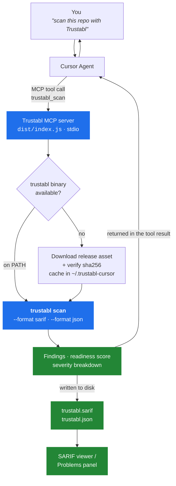

# Trustabl for Cursor

Bring [Trustabl](https://github.com/trustabl/trustabl) — the static reliability &
safety scanner for AI-agent codebases — into Cursor.

The plugin adds an **MCP server** whose tools the Cursor agent can call. Ask it to
"scan this repo with Trustabl" and it inventories your agents, tools, and MCP
servers, flags risky patterns with severities, scores production readiness, and
writes a **SARIF 2.1.0** report into your workspace so the findings render in a
SARIF viewer as well as in chat.

Detects Claude Agent SDK, OpenAI Agents SDK, Google ADK, LangChain, CrewAI,
Pydantic AI, Vercel AI, AutoGen, MCP servers, and Claude subagents & skills.

## How it works



A failed download or a checksum mismatch aborts the scan — the plugin never runs
an unverified binary.

## Install

**From Cursor:** search for **Trustabl** in the plugin directory and install it.

**From this repo:** clone it and point Cursor at the folder (Cursor auto-detects
the `.cursor-plugin/plugin.json` manifest and `mcp.json`).

Nothing else to set up: the `trustabl` binary is downloaded and sha256-verified
on first scan, then cached.

## Tools

| Tool | What it does |
|---|---|
| `trustabl_scan` | Scan a directory. Returns the readiness score, severity breakdown, and findings (worst first); writes `trustabl.sarif` + `trustabl.json` into the scanned directory. |
| `trustabl_last_findings` | Return the SARIF from the previous scan without re-running it. |

**`trustabl_scan` parameters** — all optional:

| Name | Default | Description |
|---|---|---|
| `path` | current workspace | Directory to scan. |
| `detectors` | _(all)_ | Comma-separated SDK subset, e.g. `claude_sdk,openai_sdk,mcp`. |
| `strict` | `false` | Report any finding, however minor. |

Large scans return the worst 50 findings inline to keep the agent's context
usable — the complete set is always in `trustabl.json` / `trustabl.sarif`.

## Configuration

Both optional, set in Cursor's plugin settings:

| Variable | Default | Description |
|---|---|---|
| `TRUSTABL_VERSION` | `latest` | Release tag to run, e.g. `v0.1.6`. Pin it for reproducible results. |
| `GITHUB_TOKEN` | _(none)_ | Only used to download the release binary; avoids GitHub's 60-requests/hour anonymous limit. |

`TRUSTABL_BIN` (env) forces a specific binary — useful if you already have
`trustabl` installed somewhere non-standard.

## Try it

Ask the agent:

> Scan this repository with Trustabl and summarise the high-severity findings.

Then open `trustabl.sarif` with a SARIF viewer extension to browse the findings
inline in your code.

## Development

```bash
cd server
npm install
npm run build     # bundles to ../dist/index.js (commit the result)
```

`dist/index.js` is committed because Cursor runs the server directly from the
installed plugin — it does not install npm dependencies. The bundle has no
runtime dependencies. Rebuild and commit `dist/` after changing anything in
`server/`.

Test the server without Cursor:

```bash
npx @modelcontextprotocol/inspector node dist/index.js
```

## Troubleshooting

**The tools don't appear in Cursor.** Check Cursor's MCP logs for the `trustabl`
server. If the launch path failed to resolve, replace `${PLUGIN_ROOT}` in
`mcp.json` with an absolute path to `dist/index.js`.

**"Could not resolve the latest trustabl release."** GitHub rate-limited the
anonymous API call — set `GITHUB_TOKEN`, or pin `TRUSTABL_VERSION` to a tag.

**Windows.** Supported (amd64). Extraction uses the built-in `tar`, present on
Windows 10 build 17063 and later.

## License

Proprietary — see [LICENSE](LICENSE). The Trustabl scanner itself is
[Apache-2.0](https://github.com/trustabl/trustabl).
