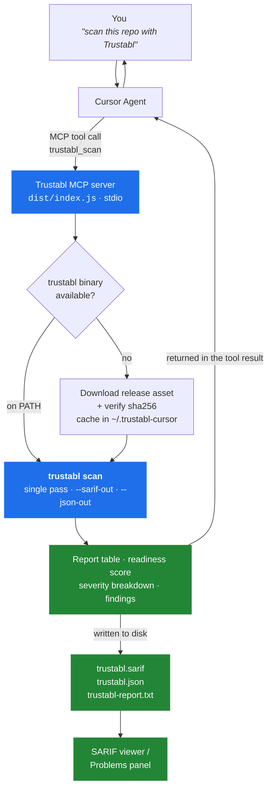

# Trustabl for Cursor

Bring [Trustabl](https://github.com/trustabl/trustabl) — the static reliability &
safety scanner for AI-agent codebases — into Cursor.

The plugin adds an **MCP server** whose tools the Cursor agent can call. Ask it to
"scan this repo with Trustabl" and it inventories your agents, tools, and MCP
servers, flags risky patterns with severities, scores production readiness, and
writes a **SARIF 2.1.0** report into your workspace so the findings render in a
SARIF viewer as well as in chat.

Detects Claude Agent SDK, OpenAI Agents SDK, Google ADK, LangChain, CrewAI,
Pydantic AI, Vercel AI, AutoGen, MCP servers, and Claude subagents & skills.

## How it works



A failed download or a checksum mismatch aborts the scan — the plugin never runs
an unverified binary.

## Install

Three ways, same result. Pick one.

| | Best for |
|---|---|
| **1. Plugin directory** | Most people — one click, updates handled by Cursor. |
| **2. Local plugin folder** | Trying it before it's published, or running a fork. |
| **3. Plain MCP server** | Skipping the plugin system, or using a client other than Cursor. |

### 1. From the Cursor plugin directory

1. In Cursor, open **Customize** (Settings → the *"Plugins, MCPs, Skills and
   Rules have moved to Customize"* banner links there too).
2. **Browse Marketplace** → search **Trustabl** → **Install**.

### 2. From this repo, as a local plugin

Clone it into Cursor's local plugin folder and restart Cursor:

```bash
git clone https://github.com/trustabl/trustabl-cursor.git
# macOS / Linux
cp -r trustabl-cursor ~/.cursor/plugins/local/
# Windows (PowerShell)
Copy-Item -Recurse trustabl-cursor "$HOME\.cursor\plugins\local\"
```

Cursor auto-detects `.cursor-plugin/plugin.json` and `mcp.json`. No build step
and no `npm install` — the server ships pre-bundled.

### 3. As a plain MCP server

Registers the server directly, bypassing the plugin system entirely. Clone the
repo anywhere, then add it to `~/.cursor/mcp.json` (global) or
`<your-project>/.cursor/mcp.json` (that project only), using the **absolute
path** to the clone:

```json
{
  "mcpServers": {
    "trustabl": {
      "command": "node",
      "args": ["/absolute/path/to/trustabl-cursor/dist/index.js"]
    }
  }
}
```

On Windows use forward slashes: `C:/Users/you/trustabl-cursor/dist/index.js`.
Restart Cursor.

The same block works in any MCP client — Claude Code, Windsurf, VS Code — since
it is a standard stdio MCP server. Set `TRUSTABL_VERSION` / `GITHUB_TOKEN` under
an `"env"` key here rather than in Cursor's plugin settings.

### Check it's working

**Customize → Plugins → Trustabl Cursor.** Under **MCPs** you should see:

```
trustabl  ● 2 tools enabled
```

A green dot means the server started. If it's red, open **Configure → Show
Output** for the error (see [Troubleshooting](#troubleshooting)). With method 3
the server appears under **Customize → MCPs** instead of under a plugin.

Nothing else to set up: the `trustabl` binary is downloaded and sha256-verified
on first scan, then cached in `~/.trustabl-cursor/`.

## Using it in chat

Open the repo you want to check, start a chat (`Ctrl/Cmd + L`), and ask for a
scan in plain language:

> Scan this repository with Trustabl and summarise the high-severity findings.

The agent calls `trustabl_scan` and replies with the severity table, the
readiness score, and the findings. The first scan on a machine also downloads
the scanner (~14 MB); later scans skip straight to scanning — around 20 seconds
for a large repo.

Other prompts that work well:

> Scan `./services/agent` with Trustabl.
>
> Scan this repo with Trustabl, then fix the highest-severity finding.
>
> Scan with Trustabl using only the `mcp` and `claude_sdk` detectors.
>
> Show me the findings from the last Trustabl scan.   ← no re-scan

Because findings come back as structured data with file paths and line numbers,
the agent can jump straight to the code and propose fixes — ask it to fix what
it found and it will.

After a scan, three files land in the scanned directory:

| File | Use |
|---|---|
| `trustabl.sarif` | Open with a SARIF viewer extension to see findings inline on your code. |
| `trustabl.json` | Full machine-readable results — every finding, not just the ones shown in chat. |
| `trustabl-report.txt` | The complete console report, ready to paste into a ticket. |

## Tools

| Tool | What it does |
|---|---|
| `trustabl_scan` | Scan a directory. Returns a severity table, the readiness score, the scan report, and findings (worst first); writes `trustabl.sarif`, `trustabl.json`, and `trustabl-report.txt` into the scanned directory. |
| `trustabl_last_findings` | Return the SARIF from the previous scan without re-running it. |

**`trustabl_scan` parameters** — all optional:

| Name | Default | Description |
|---|---|---|
| `path` | current workspace | Directory to scan. |
| `detectors` | _(all)_ | Comma-separated SDK subset, e.g. `claude_sdk,openai_sdk,mcp`. |
| `strict` | `false` | Report any finding, however minor. |

Large scans return the worst 50 findings inline, and the scan report is excerpted,
to keep the agent's context usable — the complete set is always in
`trustabl.json` / `trustabl.sarif` / `trustabl-report.txt`.

Example of what comes back:

```
## Trustabl scan — /path/to/repo

**Readiness 91/100** · risk 9 · 454 findings · max severity `high` · **gated**

| severity | count | share
|----------|-------|------
| critical |     0 |
| high     |    97 | ████
| medium   |    24 | █
| low      |   317 | ██████████████
| info     |    16 | █
| **total**|   454 |
```

## Configuration

Both optional, set in Cursor's plugin settings:

| Variable | Default | Description |
|---|---|---|
| `TRUSTABL_VERSION` | `latest` | Release tag to run, e.g. `v0.1.6`. Pin it for reproducible results. |
| `GITHUB_TOKEN` | _(none)_ | Only used to download the release binary; avoids GitHub's 60-requests/hour anonymous limit. |

`TRUSTABL_BIN` (env) forces a specific binary — useful if you already have
`trustabl` installed somewhere non-standard.

## Development

```bash
cd server
npm install
npm run build     # bundles to ../dist/index.js (commit the result)
```

`dist/index.js` is committed because Cursor runs the server directly from the
installed plugin — it does not install npm dependencies. The bundle has no
runtime dependencies. Rebuild and commit `dist/` after changing anything in
`server/`.

Test the server without Cursor:

```bash
npx @modelcontextprotocol/inspector node dist/index.js
```

## Troubleshooting

**The tools don't appear in Cursor.** Open **Customize → Trustabl Cursor →
Configure → Show Output** to see why the server exited. If the error is
`Cannot find module '...${PLUGIN_ROOT}...'`, your Cursor build doesn't expand
that variable — replace `cwd` in `mcp.json` with an absolute path to the plugin
folder.

**Changed something and the fix didn't take.** MCP servers don't hot-reload:
**Configure → Reload** (or restart Cursor) after editing the plugin.

**"Could not resolve the latest trustabl release."** GitHub rate-limited the
anonymous API call — set `GITHUB_TOKEN`, or pin `TRUSTABL_VERSION` to a tag.

**Windows.** Supported (amd64). The release `.zip` is unpacked with PowerShell's
`Expand-Archive`; macOS and Linux use `tar`.

## License

Proprietary — see [LICENSE](LICENSE). The Trustabl scanner itself is
[Apache-2.0](https://github.com/trustabl/trustabl).
